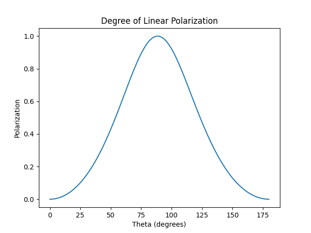
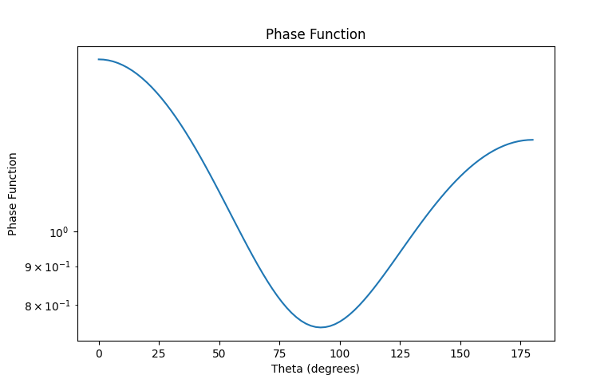

# Summary

`mieshah` is a Python package to assist scientific community who deal with light scattering from spherical particles of various sizes or distribution of particles. It uses Mie theory calculations and the command sets are very easy to use.   

Primarily it will help those research community who deal with light scattering from atmospheric dust, water droplets, and particles.


# Statement of Need

There are several Mie theory python packages available on Github or PyPi. However they often do not give correct calculation results and their utilty not proved by any scientific paper. In this scenario it becomes very necessary to design a package that is based on a previously tested and published code. The `mieshah` package is based on a widely used FORTRAN code originally published by [@Shah1977]. This code have been used by several authors including [@Sen1991;@Das2004] in their light scattering calculations from cometary dust. The FORTRAN code have been converted into a Python code and by intruducing `mieshah` class it has been made user friendly. Now a user can easily calculate parameters like Extinction efficiency, Scattering efficiency, Albedo, etc. and plot graphs for degree of linear polarisation or phase function against the scattering angle with only a small piece of code.      

`mieshah` addresses these limitations by providing:

- A comprehensive and reliable Mie calculator.
- Supports calculation for single particle or particle size distribution with a single command.
- Generates output as both files and Python variables so that the output persists even after the termination of the program. 
- Polarization, Phase function, etc. are stored in a `list` type variable so that they can be easily plotted by `matplotlib` package.

Above charcteristics distinguishes this package from other Mie packages for Python and makes it useful for research purpose. 
{ width=60% }
{ width=50% }


# Installation

You can install the stable version from PyPI:

```bash
pip install mieshah
```

Or install the latest development version from GitHub:

```bash
pip install git+https://github.com/DwaipayanDeb/mieshah
```
# Dependencies

This package needs following three packages to be pre-installed on a computer before use: `numpy`, `sympy`, and `dimpy`.

# Usage

An example to use this package 

```python
import mieshah as ms
from matplotlib import pyplot as plt

# ps-> particle radius(microns), wl-> wavelength (microns), m-> complex refractive index (real,imaginary), 
# f-> size distribution function, incr-> increment for size distribution function
mymie = ms.miescatter(ps=[0.1,1], wl=6.283185307,m=(1.5,0),f="x**-2",incr=0.01)  # With size distribution function
#mymie = ms.miescatter(ps=100, wl=6.283185307,m=(1.5,0.0)) # Without size distribution function (single particle)

print(mymie.ps)
print(mymie.wl)
print(mymie.m)
print(mymie.f)
print(mymie.X) # Size parameter
print(mymie.ALBED) # Albedo
print(mymie.QSCA) # Scattering efficiency
print(mymie.QEXT) # Extinction efficiency
print(mymie.QBAK) # Backscattering efficiency
print(mymie.QABS) # Absorption efficiency
print(mymie.QPR) # Radiation pressure efficiency
print(mymie.I_perp) # Intensity perpendicular to the plane of incidence
print(mymie.I_parl) # Intensity parallel to the plane of incidence
print(mymie.Polar) # Degree of linear polarization
print(mymie.p_theta) # Phase function
print(mymie.theta) # Scattering angle in degrees

plt.plot(mymie.theta[::2], mymie.Polar[::2])
plt.xlabel('Theta (degrees)')
plt.ylabel('Polarization')
plt.title('Degree of Linear Polarization')
plt.show()
plt.plot(mymie.theta[::2], mymie.p_theta[::2])
plt.yscale('log')    
plt.xlabel('Theta (degrees)')
plt.ylabel('Phase Function')
plt.title('Phase Function')
plt.show()
```


# Acknowledgements

This work is not funded by any Govt./Private sector funding agency. The author thanks Dr. Himadri Sekhar Das of Assam University for providing the original source of FORTRAN code.

# References


